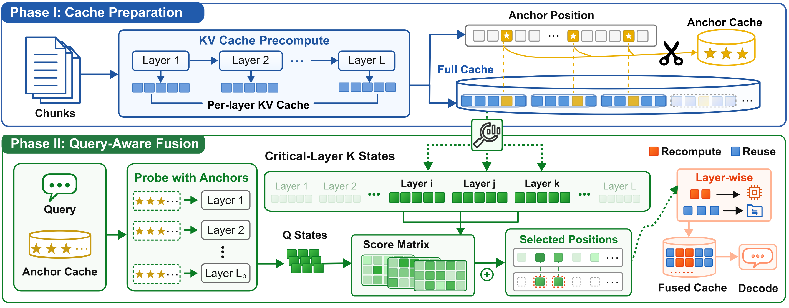
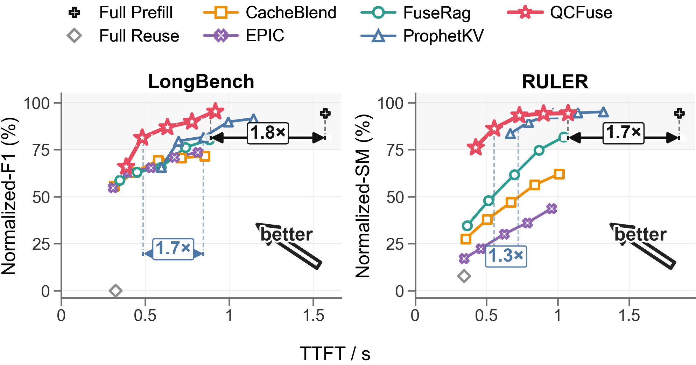

<div align="center">
  <div style="display: inline-flex; align-items: stretch; gap: 0.75rem; max-width: 980px;">
    <div style="display: flex; align-items: center; justify-content: center; flex: 0 0 68px;">
      
    </div>
    <h1 style="margin: 0; text-align: left; line-height: 1.18;">
      <span style="font-family: 'Avenir Next', 'Trebuchet MS', 'Segoe UI', sans-serif; font-size: 1.06em; font-weight: 650; letter-spacing: 0.01em;">QCFuse</span>: Query-Aware Cache Fusion via Compressed View for Efficient RAG Serving
    </h1>
  </div>
</div>

<br>

<p align="center">
  <a href="http://arxiv.org/abs/2606.05875"></a>
</p>

QCFuse is a **pipeline-constrained, query-aware KV cache fusion** system for
efficient long-context RAG generation. This repository contains the QCFuse
research artifact described in [arXiv:2606.05875](http://arxiv.org/abs/2606.05875).

## ✨ Highlights

<p align="center">
  
</p>

<p align="center">
  <em>QCFuse builds a compact query-aware view for pipelined cache fusion in RAG serving.</em>
</p>

- **Query-aware compressed view.** Cuts selector time and selection noise while
  preserving pipeline efficiency.
- **Pipeline-aware SGLang system.** Adds SSD-backed PIC cache transfer and
  Triton sparse reconstruction attention without extra masks.
- **Matched-quality speedup.** Reaches **1.7x** average prefill speedup over
  full prefill and **1.5x** over ProphetKV.
- **Strict-quality TTFT speedup.** Under **1%** relative quality drop, achieves
  **1.9x** average TTFT speedup over full prefill.

## 📊 Results

<p align="center">
  
</p>

<p align="center">
  <em>Quality and TTFT trade-off on LongBench and RULER. Transfer bandwidth affects the TTFT of KV cache fusion methods; paper experiments use 10GB/s.</em>
</p>

## 🗂️ Repository Layout

```text
QCFuse/
├── blend/                         # QCFuse evaluation runner and configs
│   ├── sglang_blend_ssd.py
│   ├── blend_common.py
│   ├── qcfuse_config.py
│   └── utils.py
├── srt/                           # SGLang runtime changes for QCFuse
│   ├── entrypoints/
│   ├── managers/
│   ├── layers/attention/
│   ├── models/
│   └── utils/
├── data/                          # Packaged evaluation data
│   └── qcfuse_data.zip
```

## 🗄️ Datasets

The evaluation data is provided as `data/qcfuse_data.zip`. It contains six
ready-to-run JSONL files derived from LongBench and RULER. Each dataset has
200 samples, each sample is split into 20 chunks, and the average context
length is about 10K tokens.

Extract the archive in the repository root:

```bash
unzip data/qcfuse_data.zip -d data
```

The evaluation runner expects each split as `{dataset}.jsonl` under
`--data_dir`; use `--data_dir data` after extraction. See
[data/README.md](data/README.md) for the packaged data layout.

| Benchmark | Official source | Tasks used in this artifact |
| --- | --- | --- |
| LongBench | [THUDM/LongBench](https://github.com/THUDM/LongBench) | `musique`, `2wikimqa`, `hotpotqa` |
| RULER | [NVIDIA/RULER](https://github.com/NVIDIA/RULER) | `ruler_mv` (`MV`), `ruler_mq` (`MQ`), `ruler_vt` (`VT`) |

## ⚙️ Installation

Download SGLang **0.5.4**, replace its `sglang/python/sglang/` package with
the QCFuse code, and then build it:

```bash
git clone -b v0.5.4 https://github.com/sgl-project/sglang.git
cd sglang
pip install --upgrade pip
pip install -e "python"
```

Return to the QCFuse repository root before running the commands below.

Install the evaluation dependencies used by the Blend runner:

```bash
pip install rouge-score
```

Use a CUDA/PyTorch environment compatible with your GPU and SGLang 0.5.4. The
runner expects local model files and local JSONL datasets.

## 🚀 Running QCFuse

Run the SSD-backed QCFuse method:

```bash
python blend/sglang_blend_ssd.py \
  --model qwen3-8b \
  --model_dir models \
  --data_dir data \
  --dataset hotpotqa \
  --baseline ours \
  --size 200 \
  --cache_dir cache/qcfuse
```

`--cache_dir` stores the SSD-backed chunk and query caches. With
`--baseline ours`, the runner performs offline cache preparation before the
online evaluation pass. The default reconstruction ratio for `ours` is `0.5`.

Run the full-prefill baseline:

```bash
python blend/sglang_blend_ssd.py \
  --model qwen3-8b \
  --model_dir models \
  --data_dir data \
  --dataset hotpotqa \
  --baseline fullcomp \
  --size 200 \
  --cache_dir cache/qcfuse
```

Supported `--baseline` values are `ours` and `fullcomp`. Supported `--dataset`
values are `hotpotqa`, `2wikimqa`, `musique`, `ruler_mv`, `ruler_mq`, and
`ruler_vt`.

## 📚 Citation

If you find QCFuse useful, please cite:

```bibtex
@misc{yan2026qcfusequeryawarecachefusion,
      title={QCFuse: Query-Aware Cache Fusion via Compressed View for Efficient RAG Serving},
      author={Jianxin Yan and Wangze Ni and Zhenxin Li and Jiabao Jin and Zhitao Shen and Haoyang Li and Jia Zhu and Peng Cheng and Xuemin Lin and Lei Chen and Kui Ren},
      year={2026},
      eprint={2606.05875},
      archivePrefix={arXiv},
      primaryClass={cs.AI},
      url={https://arxiv.org/abs/2606.05875},
}
```
